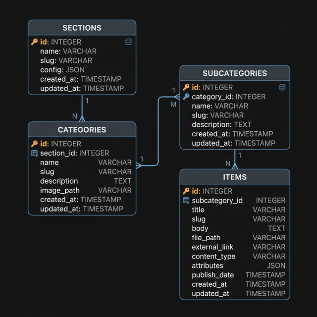
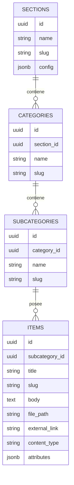

# Diseño de la BBDD: Estructura Escalable y Genérica

Este documento detalla la arquitectura de la base de datos para la plataforma CMS Telmark.

## 1. Filosofía del Diseño

El sistema está diseñado para ser **genérico** y **escalable**, permitiendo gestionar diferentes tipos de información (Adeslas, Energía, Alarma) bajo una misma estructura de 4 niveles.

### ¿Por qué UUID?

- **Seguridad**: Los IDs no son predecibles en las URLs.
- **Escalabilidad**: Evita colisiones al sincronizar datos entre diferentes entornos.

## 2. Diagrama Entidad-Relación (ERD)



### Estructura Técnica (Mermaid)



## 3. Flexibilidad con `jsonb`

Las columnas `config` (en SECTIONS) y `attributes` (en ITEMS) permiten guardar datos dinámicos sin necesidad de modificar las tablas. Esto garantiza que el sistema pueda adaptarse a nuevos requisitos sin cambios en el código base del backend.

## 5. Script SQL (Para Supabase)

Código del proyecto en Supabase para crear la estructura:

```sql
-- 1. SECCIONES
create table sections (
  id uuid default gen_random_uuid() primary key,
  name text not null,
  slug text unique not null,
  config jsonb default '{}'::jsonb,
  created_at timestamp with time zone default timezone('utc'::text, now()) not null
);

-- 2. CATEGORIAS
create table categories (
  id uuid default gen_random_uuid() primary key,
  section_id uuid references sections(id) on delete cascade not null,
  name text not null,
  slug text not null,
  created_at timestamp with time zone default timezone('utc'::text, now()) not null,
  unique(section_id, slug)
);

-- 3. SUBCATEGORIAS
create table subcategories (
  id uuid default gen_random_uuid() primary key,
  category_id uuid references categories(id) on delete cascade not null,
  name text not null,
  slug text not null,
  created_at timestamp with time zone default timezone('utc'::text, now()) not null,
  unique(category_id, slug)
);

-- 4. ITEMS (Contenido)
create table items (
  id uuid default gen_random_uuid() primary key,
  subcategory_id uuid references subcategories(id) on delete cascade not null,
  title text not null,
  slug text not null,
  body text,
  file_path text,
  external_link text,
  content_type text check (content_type in ('info', 'document', 'file', 'link')) default 'info',
  attributes jsonb default '{}'::jsonb,
  created_at timestamp with time zone default timezone('utc'::text, now()) not null,
  unique(subcategory_id, slug)
);

-- Habilitar RLS
alter table sections enable row level security;
alter table categories enable row level security;
alter table subcategories enable row level security;
alter table items enable row level security;

-- Políticas de lectura pública
create policy "Public read" on sections for select using (true);
create policy "Public read" on categories for select using (true);
create policy "Public read" on subcategories for select using (true);
create policy "Public read" on items for select using (true);
```

---

*Ultima actualización: 2026-03-04*
