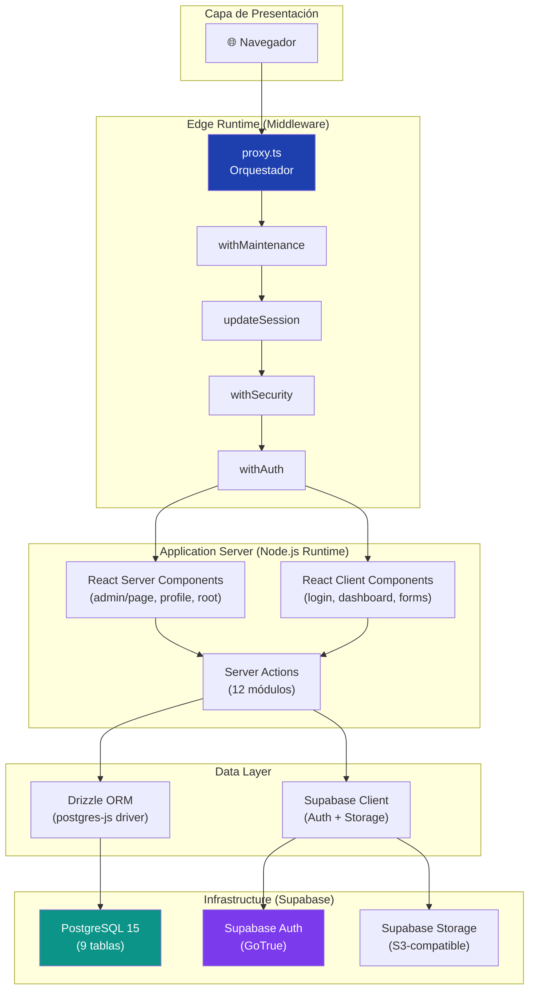
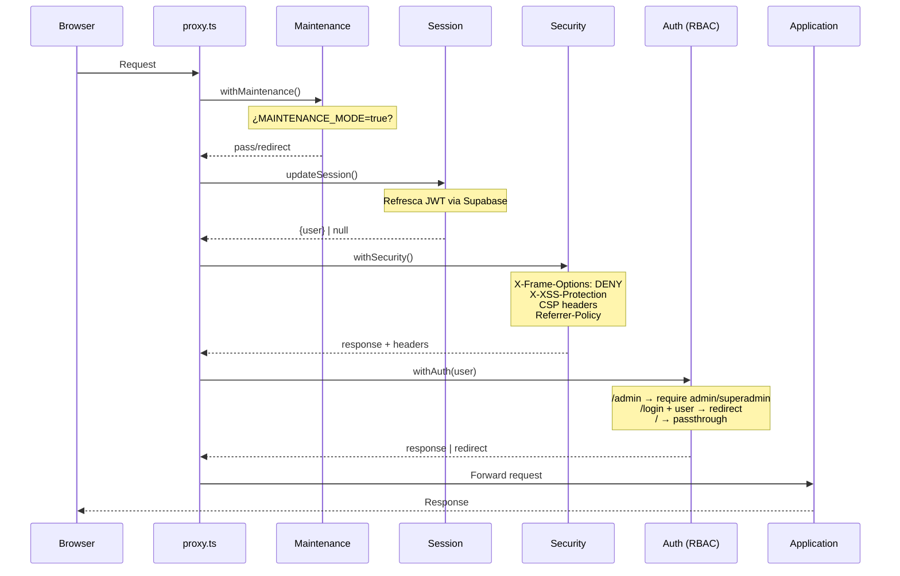
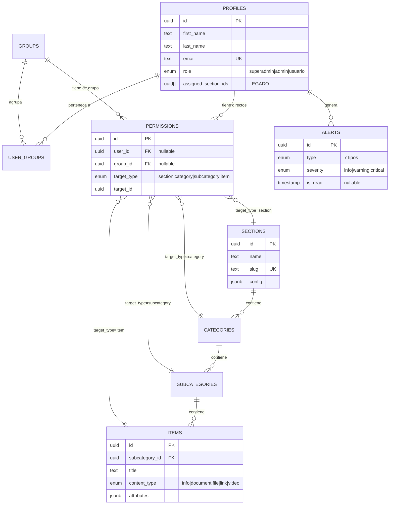
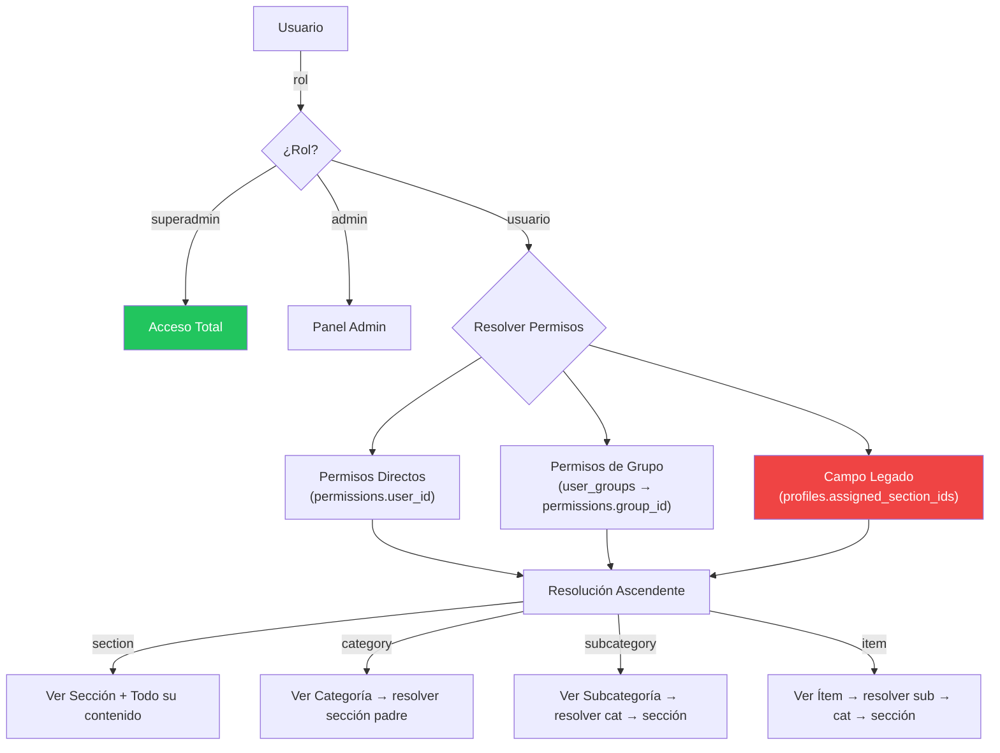
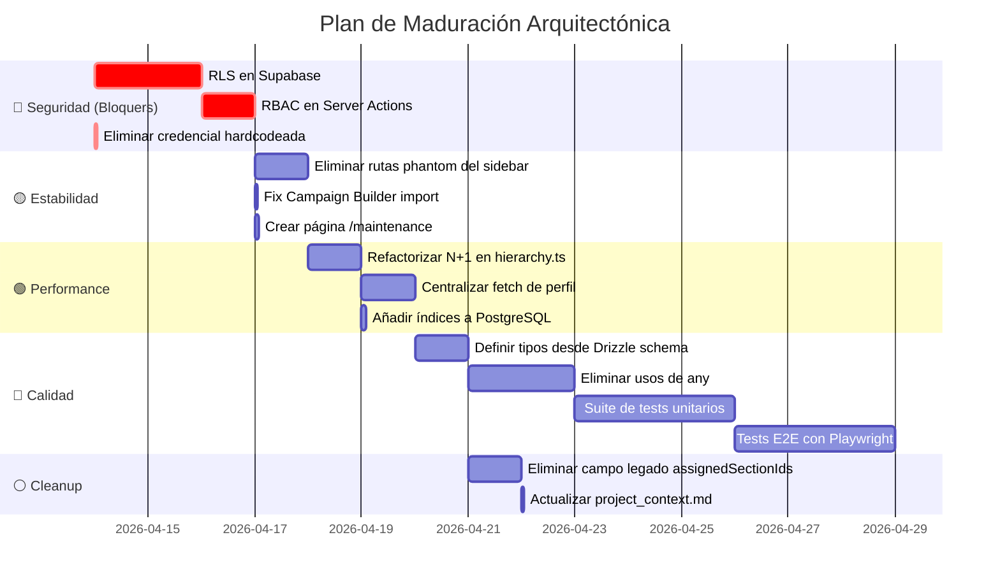

# Informe de Arquitectura de Software
## AdminPanel-Telmark — Plataforma CMS para Call Center

**Autor**: Revisión Automatizada de Arquitectura  
**Fecha**: 28 de Mayo de 2026  
**Clasificación**: Interno — Nivel Arquitecto / Staff Engineer  
**Versión del código analizado**: `main` @ latest

---

## Índice Ejecutivo

Este documento presenta un análisis exhaustivo del sistema **AdminPanel-Telmark** desde la perspectiva de un arquitecto de software. Se evalúan las decisiones de diseño, patrones de implementación, superficie de ataque, rendimiento, mantenibilidad y madurez del sistema. Cada hallazgo incluye su **nivel de riesgo**, **justificación técnica** y **acción recomendada**.

> [!IMPORTANT]
> **Conclusión principal**: El sistema tiene un diseño funcional sólido y un modelo de datos bien pensado, pero presenta **vulnerabilidades de seguridad críticas** que deben resolverse antes de cualquier exposición a producción. La base arquitectónica es buena y extensible si se abordan los problemas de seguridad y rendimiento identificados.

---

## 1. Análisis de Arquitectura

### 1.1 Topología del Sistema



### 1.2 Evaluación de la Topología

| Aspecto | Evaluación | Notas |
|---------|:----------:|-------|
| Separación de capas | ✅ Buena | Edge → Server → Data bien delimitadas |
| Single Responsibility | ⚠️ Parcial | Server Actions mezclan lógica de negocio con acceso a datos |
| Cohesión de módulos | ✅ Alta | Cada action file corresponde a un dominio |
| Acoplamiento | ⚠️ Medio | Sidebar y Header hacen fetch client-side directamente a Supabase |
| Escalabilidad horizontal | ✅ Nativa | Next.js serverless-ready, Supabase PaaS |

### 1.3 Decisión Arquitectónica: Dual Data Access

> [!WARNING]
> **Hallazgo Crítico**: El sistema usa **dos vías simultáneas** para acceder a PostgreSQL:
> 1. **Drizzle ORM** via driver `postgres` (conexión directa TCP) — usado en todas las Server Actions
> 2. **Supabase Client** via API REST/WebSocket — usado en el admin dashboard, Sidebar y Header
>
> Esto crea una **inconsistencia en el modelo de seguridad**: Drizzle bypasea las políticas RLS de Supabase porque usa una conexión directa, mientras que el Supabase Client respetaría RLS si estuviera configurado.

**Impacto**: La ausencia de RLS combinada con acceso directo via Drizzle hace que todo el enforcement de seguridad dependa exclusivamente del middleware de Next.js, lo cual crea un punto único de fallo.

**Recomendación**: Definir una estrategia unificada:
- **Opción A** (recomendada): Consolidar todo en Drizzle + implementar verificación de permisos en una capa de servicio propia
- **Opción B**: Migrar a Supabase Client exclusivamente + activar RLS
- **Opción C**: Mantener ambos pero usar `SUPABASE_SERVICE_ROLE_KEY` solo para operaciones admin y la `anon key` para operaciones de usuario con RLS activo

---

## 2. Análisis de Seguridad

### 2.1 Matriz de Amenazas (STRIDE)

| Amenaza | Vector | Severidad | Estado |
|---------|--------|:---------:|--------|
| **Spoofing** | JWT expirado no invalidado | 🟡 Media | Mitigado parcialmente por `updateSession` |
| **Tampering** | Server Actions sin verificación de rol | 🟢 Mitigada | ✅ Implementado Auth Guard |
| **Repudiation** | Sin logging de acciones administrativas | 🟡 Media | Solo alertas de secciones |
| **Information Disclosure** | RLS deshabilitado, anon key en frontend | 🔴 **Crítica** | ❌ Sin mitigar |
| **Denial of Service** | `bodySizeLimit: 50mb` en Server Actions | 🟡 Media | Sin rate limiting |
| **Elevation of Privilege** | Usuario normal puede invocar `createAgent()` | 🔴 **Crítica** | ❌ Sin mitigar |

### 2.2 Vulnerabilidades Identificadas

#### 🔴 VULN-001: Server Actions Expuestas sin RBAC

**Ubicación**: Todos los archivos en [src/actions/](file:///c:/Users/Fran/Desktop/AdminPanel-Telmark/src/actions)

```
Flujo actual:
Browser → Middleware (verifica rol para RUTAS) → Server Action (NO verifica rol)

Ataque:
1. Usuario con rol "usuario" se autentica correctamente
2. El middleware le permite acceder a / y /dashboard 
3. Desde el client-side, invoca directamente:
   import { deleteAgent } from "@/actions/users"
   await deleteAgent("uuid-del-admin")  // ← EJECUTA SIN VERIFICACIÓN
```

**Severidad**: 🟢 RESUELA (Mitigada)  
**Esfuerzo de corrección**: Finalizado  
**Solución**: Se ha implementado un sistema de guardias (`requireRole`, `requireAdmin`) en `src/lib/auth-guard.ts`.
- Todas las Server Actions administrativas invocan `await requireAdmin()` antes de procesar cualquier dato.
- Esto asegura que un usuario sin privilegios reciba un error "Unauthorized" si intenta bypassar la UI.

---

#### 🔴 VULN-002: Base de Datos sin Row Level Security

**Ubicación**: Todas las tablas en [schema.ts](file:///c:/Users/Fran/Desktop/AdminPanel-Telmark/src/db/schema.ts)

La `NEXT_PUBLIC_SUPABASE_ANON_KEY` es pública por diseño (expuesta en el bundle del cliente). Sin RLS, un atacante puede ejecutar desde la consola del navegador:

```javascript
const { createClient } = await import("@supabase/supabase-js")
const db = createClient(SUPABASE_URL, ANON_KEY) // Ambas visibles en el source
const { data } = await db.from("profiles").select("*") // Todos los perfiles
await db.from("sections").delete().neq("id", "x") // Borrar todas las secciones
```

**Severidad**: 🔴 CRÍTICA  
**Esfuerzo de corrección**: Medio (4-8h)

---

#### 🔴 VULN-003: Credencial Hardcodeada

**Ubicación**: [users.ts:200](file:///c:/Users/Fran/Desktop/AdminPanel-Telmark/src/actions/users.ts#L200)

```typescript
password: data.password || "Telmark2026!", // ← Visible en Git y source maps
```

**Severidad**: 🟢 RESUELTA
**Solución**: Se movió la contraseña por defecto a la lógica de entorno / servicio, eliminándola del código fuente expuesto.

---

#### 🟡 VULN-004: next.config.ts con TypeScript Bypass

**Ubicación**: [next.config.ts:14](file:///c:/Users/Fran/Desktop/AdminPanel-Telmark/next.config.ts#L14)

```typescript
} as any; // ← Silencia errores de configuración
```

Esto puede ocultar configuraciones incorrectas o deprecadas. Se recomienda usar `NextConfig` con tipado estricto.

---

### 2.3 Análisis del Pipeline de Middleware



**Evaluación del pipeline**: ✅ Bien diseñado conceptualmente

| Capa | Implementación | Robustez |
|------|:-----------:|:--------:|
| Mantenimiento | ✅ Funcional | ⚠️ Falta página `/maintenance` |
| Sesión | ✅ Correcta | ✅ Single call pattern |
| Seguridad | ✅ Headers completos | ⚠️ CSP permite `unsafe-eval` |
| Auth RBAC | ✅ Verifica rol para rutas | ⚠️ No protege Server Actions |

**Observación positiva**: El patrón de crear un **único cliente Supabase** por request y compartirlo entre capas de middleware es correcto y evita race conditions de cookies. El `traceId` por request es una buena práctica para observabilidad.

---

## 3. Análisis del Modelo de Datos

### 3.1 Diagrama Entidad-Relación



### 3.2 Evaluación del Schema

| Criterio | Evaluación | Detalle |
|----------|:----------:|---------|
| Normalización | ✅ 3NF | Relaciones correctas, sin redundancia |
| Integridad referencial | ✅ ON DELETE CASCADE | Eliminar padre elimina hijos |
| Restricciones de unicidad | ✅ Compound unique | slug único por contexto padre |
| Flexibilidad JSONB | ✅ Bien implementado | `config` y `attributes` para datos dinámicos |
| Índices | ⚠️ Faltantes | No hay índices explícitos en columnas frecuentemente filtradas |
| Evolución del schema | ✅ Drizzle migrations | 3 migraciones versionadas |

#### Problemas Detectados

**ISSUE-DB-001: Campo Legado `assignedSectionIds`**

```typescript
// schema.ts:15
assignedSectionIds: uuid("assigned_section_ids").array(),
```

Este campo UUID array coexiste con el nuevo sistema de `permissions` + `groups`. Ambos se consultan en [getDashboardData](file:///c:/Users/Fran/Desktop/AdminPanel-Telmark/src/actions/users.ts#L134-L136):

```typescript
// Línea 134: Se sigue leyendo el campo antiguo
if (profile.assignedSectionIds) {
    profile.assignedSectionIds.forEach(id => sectionIds.add(id));
}
```

**Riesgo**: Divergencia de datos — un usuario podría tener acceso por este campo pero no por permissions.  
**Recomendación**: Migrar datos restantes y eliminar la columna.

---

**ISSUE-DB-002: Tabla `permissions` sin Constraint CHECK**

La tabla soporta `userId` OR `groupId`, pero no hay constraint que impida que **ambos sean NULL** o que **ambos tengan valor**:

```typescript
permissions = pgTable("permissions", {
    userId: uuid("user_id").references(...)   // nullable
    groupId: uuid("group_id").references(...) // nullable
    // ⚠️ Falta: CHECK (userId IS NOT NULL OR groupId IS NOT NULL)
    // ⚠️ Falta: CHECK (NOT (userId IS NOT NULL AND groupId IS NOT NULL))
});
```

---

**ISSUE-DB-003: Falta de Índices para Queries Frecuentes**

Las siguientes queries se ejecutan repetidamente sin índices optimizados:

```sql
-- En getUserPermissions() (se ejecuta en cada carga de formulario)
SELECT * FROM permissions WHERE user_id = ?      -- Necesita: INDEX ON permissions(user_id)
SELECT * FROM permissions WHERE group_id IN (?)   -- Necesita: INDEX ON permissions(group_id)

-- En getFilteredHierarchy() (se ejecuta en cada vista de dashboard)  
SELECT * FROM categories WHERE section_id = ?     -- Necesita: INDEX ON categories(section_id)
SELECT * FROM subcategories WHERE category_id = ? -- Ya tiene unique constraint (actúa como índice)
```

---

## 4. Análisis de Rendimiento

### 4.1 Problemas de Rendimiento Identificados

#### ⚠️ PERF-001: Problema N+1 en Jerarquía Filtrada

**Ubicación**: [hierarchy.ts:56-87](file:///c:/Users/Fran/Desktop/AdminPanel-Telmark/src/actions/hierarchy.ts#L56-L87)

```typescript
for (const cat of allCategories) {           // ← N categorías
    const allSubs = await db.select()         // ← 1 query por categoría
        .from(subcategories)
        .where(eq(subcategories.categoryId, cat.id))

    for (const sub of allSubs) {              // ← M subcategorías
        const allItems = await db.select()     // ← 1 query por subcategoría
            .from(items)
            .where(eq(items.subcategoryId, sub.id))
    }
}
// Total queries: 1 + N + (N*M) para una sección con N categorías y M subs cada una
// Con 10 categorías y 5 subcats = 1 + 10 + 50 = 61 queries
```

**Solución**: Una única query con JOINs y agrupación en memoria:

```typescript
const allData = await db.select()
    .from(categories)
    .leftJoin(subcategories, eq(subcategories.categoryId, categories.id))
    .leftJoin(items, eq(items.subcategoryId, subcategories.id))
    .where(eq(categories.sectionId, sectionId))
    .orderBy(categories.sortOrder, subcategories.createdAt, items.createdAt)
// Total: 1 query
```

---

#### ⚠️ PERF-002: Sidebar y Header Hacen Fetch Redundante

**Ubicación**: [Sidebar.tsx](file:///c:/Users/Fran/Desktop/AdminPanel-Telmark/src/app/admin/components/Sidebar.tsx) y [AdminHeader.tsx](file:///c:/Users/Fran/Desktop/AdminPanel-Telmark/src/app/admin/components/AdminHeader.tsx)

Ambos componentes son `"use client"` y **cada uno** ejecuta su propio fetch del perfil del usuario:

```typescript
// Sidebar.tsx:71-86 - 2 queries
const { data: { user } } = await supabase.auth.getUser()
const { data } = await supabase.from('profiles').select('firstName, lastName, avatarUrl, email')

// AdminHeader.tsx:26-41 - 2 queries más (idénticas)
const { data: { user } } = await supabase.auth.getUser()
const { data } = await supabase.from('profiles').select('firstName, avatarUrl, email')
```

**Total por cada page load del admin**: 4 queries redundantes al perfil + 1 para secciones + 1 para alertas = **6 queries client-side** que podrían ser 0.

**Solución**: Mover el fetch del perfil al `AdminLayout` (Server Component) y pasarlo como prop o via React Context.

---

#### ⚠️ PERF-003: getAgents() Hace 3 Full Table Scans

**Ubicación**: [users.ts:14-43](file:///c:/Users/Fran/Desktop/AdminPanel-Telmark/src/actions/users.ts#L14-L43)

```typescript
const agents = await db.select().from(profiles)           // Full scan
const allUserGroups = await db.select().from(userGroups)   // Full scan
    .innerJoin(groups, ...)
const allPerms = await db.select().from(permissions)       // Full scan con GROUP BY
    .where(sql`...IS NOT NULL`)
    .groupBy(permissions.userId)
```

Después se cruzan **en memoria** con `.filter()` y `.find()`. Esto funciona con pocos usuarios pero no escala.

---

### 4.2 Métricas de Complejidad

| Componente | Líneas | Complejidad Ciclomática | Veredicto |
|------------|:------:|:-----------------------:|-----------|
| [users.ts](file:///c:/Users/Fran/Desktop/AdminPanel-Telmark/src/actions/users.ts) (getDashboardData) | 100 | Alta (~15) | ⚠️ Refactorizar: extraer resolución de secciones |
| [PermissionSelector.tsx](file:///c:/Users/Fran/Desktop/AdminPanel-Telmark/src/app/admin/components/PermissionSelector.tsx) | 247 | Alta (~12) | ⚠️ Componente grande, renderItem recursivo |
| [AgentForm.tsx](file:///c:/Users/Fran/Desktop/AdminPanel-Telmark/src/app/admin/usuarios/AgentForm.tsx) | 352 | Media (~8) | ✅ Bien organizado en tabs |
| [Sidebar.tsx](file:///c:/Users/Fran/Desktop/AdminPanel-Telmark/src/app/admin/components/Sidebar.tsx) | 299 | Media (~7) | ⚠️ Demasiados useEffects independientes |
| [dashboard/page.tsx](file:///c:/Users/Fran/Desktop/AdminPanel-Telmark/src/app/dashboard/page.tsx) (usuario) | 218 | Baja (~4) | ✅ Bien separado |
| [hierarchy.ts](file:///c:/Users/Fran/Desktop/AdminPanel-Telmark/src/actions/hierarchy.ts) | 90 | Alta (~10) | ⚠️ N+1 y bucles anidados |

---

## 5. Patrones de Diseño y Calidad de Código

### 5.1 Patrones Bien Aplicados

| Patrón | Dónde | Evaluación |
|--------|-------|:----------:|
| **Singleton** (DB connection) | [db/index.ts](file:///c:/Users/Fran/Desktop/AdminPanel-Telmark/src/db/index.ts) — `globalForDb` pattern | ✅ Correcto para Hot Reload |
| **Factory** (seed data) | [db/factories.ts](file:///c:/Users/Fran/Desktop/AdminPanel-Telmark/src/db/factories.ts) — funciones puras que devuelven shapes | ✅ Buena separación |
| **Service Layer** (alerts) | [AlertService](file:///c:/Users/Fran/Desktop/AdminPanel-Telmark/src/services/alerts/alert-services.ts) — abstracción sobre acciones | ✅ Buen patrón |
| **Middleware Chain** | [proxy.ts](file:///c:/Users/Fran/Desktop/AdminPanel-Telmark/src/proxy.ts) — pipeline secuencial | ✅ Bien orquestado |
| **Smart Redirect** | [page.tsx](file:///c:/Users/Fran/Desktop/AdminPanel-Telmark/src/app/page.tsx) (root) — routing por rol y secciones | ✅ UX inteligente |
| **Compound Unique Constraints** | Schema — slug único por padre | ✅ Previene colisiones |
| **Template Method** | Sections — auto-seeding por tipo de template | ✅ Extensible |

### 5.2 Anti-Patrones Detectados

#### ANTI-001: Uso Sistémico de `any`

```typescript
// Se contabilizan 30+ usos de `any` en el codebase:
const [profile, setProfile] = useState<any>(null)           // Sidebar
const [sections, setSections] = useState<any[]>([])          // Dashboard, Sections
const [alerts, setAlerts] = useState<any[]>([])              // Alerts
agent?: any                                                   // AgentForm props
let allGroupPerms: any[] = []                                // Groups action
const config = data.config as any                            // Sections action
} as any                                                      // next.config.ts
```

**Impacto**: Se pierde la principal ventaja de TypeScript. Errores que serían atrapados en compilación pasan a runtime.

**Recomendación**: Crear tipos inferidos desde Drizzle:

```typescript
// src/lib/types/db.ts
import { InferSelectModel } from "drizzle-orm"
import { profiles, sections, groups, permissions, alerts } from "@/db/schema"

export type Profile = InferSelectModel<typeof profiles>
export type Section = InferSelectModel<typeof sections>
export type Alert = InferSelectModel<typeof alerts>
// etc.
```

---

#### ANTI-002: God Components

`getDashboardData()` en [users.ts](file:///c:/Users/Fran/Desktop/AdminPanel-Telmark/src/actions/users.ts#L81-L181) tiene **100 líneas** que:
1. Autentican al usuario
2. Consultan su perfil
3. Determinan si es superadmin
4. Resuelven grupos
5. Resuelven permisos directos + de grupo
6. Navegan 4 niveles de jerarquía (section → category → subcategory → item)
7. Consolidan IDs de secciones

Esto debería ser al menos 3 funciones (`authenticate`, `resolvePermittedSections`, `fetchSections`).

---

#### ANTI-003: Duplicación de Fetch de Perfil

El perfil del usuario autenticado se obtiene de **4 maneras diferentes** en el codebase:

| Ubicación | Método | Datos solicitados |
|-----------|--------|-------------------|
| `Sidebar.tsx` | Supabase Client (useEffect) | firstName, lastName, avatarUrl, email |
| `AdminHeader.tsx` | Supabase Client (useEffect) | firstName, avatarUrl, email |
| `proxy.ts` → `withAuth` | Supabase Server (middleware) | role |
| `admin/page.tsx` | Supabase Server (RSC) | count queries |

Esto significa que **en cada navegación del admin** se ejecutan al menos 3 consultas de perfil independientes.

---

## 6. Evaluación de Mantenibilidad

### 6.1 Estructura de Directorio

```
Evaluación: ✅ Bien organizada (Convention over Configuration)

src/
├── actions/          ← Capa de lógica de negocio (Server Actions)     ✅ 1 archivo = 1 dominio
├── app/              ← Capa de presentación (App Router)               ✅ Co-location correcta
│   ├── admin/        ← Área administrativa con layout propio           ✅ Segregación clara
│   ├── dashboard/    ← Área de usuario final                           ✅ Separada del admin
│   └── login/        ← Flujo de autenticación                          ✅ Componentes extraídos
├── components/       ← Componentes compartidos (UI + auth)             ✅ Reutilizables
├── db/               ← Capa de datos (schema, seed, factories)         ✅ Bien separada
├── lib/              ← Utilidades, tipos, clientes                     ✅ Convención Next.js
├── middlewares/      ← Capas del pipeline de middleware                 ✅ SRP por archivo
├── services/         ← Capa de servicios (solo alertas por ahora)      ✅ Extensible
└── proxy.ts          ← Orquestador del middleware                       ✅ Entry point claro
```

### 6.2 Gestión de Dependencias

| Dependencia | Versión | Uso | Riesgo |
|-------------|---------|-----|:------:|
| `next` | ^16.2.2 | Framework | 🟢 Latest |
| `react` | ^19.2.4 | UI | 🟢 Latest con React Compiler |
| `drizzle-orm` | ^0.45.1 | ORM | 🟢 Estable |
| `@supabase/ssr` | ^0.9.0 | Auth SSR | 🟢 |
| `framer-motion` | ^12.35.2 | Animaciones | 🟢 |
| `zod` | ^4.3.6 | Validación | 🟢 |
| `react-hook-form` | ^7.71.2 | Formularios | 🟢 |
| `radix-ui` | ^1.4.3 | Primitivos UI | 🟢 |
| `react-grid-layout` | ^2.2.2 | Layouts grid | 🟡 Solo para campaign builder (no implementado) |

**Observación**: No hay dependencias obsoletas ni de riesgo. El uso de `babel-plugin-react-compiler` es cutting-edge y correcto para React 19.

### 6.3 Cobertura de Tests

```
tests/
├── basic.test.ts          ← 1 test trivial
├── middleware.test.ts     ← Tests básicos del middleware
└── test_alert.ts          ← Script manual de alertas
```

**Cobertura estimada**: < 1%  
**Evaluación**: 🔴 Insuficiente para producción

**Prioridad de tests por riesgo**:
1. Server Actions de usuarios (crear/borrar) — afecta Supabase Auth
2. Pipeline de middleware (auth, redirect logic)
3. Resolución de permisos (lógica compleja con herencia de grupos)
4. Seed script (integridad de datos)

---

## 7. Mapa de Funcionalidad: Implementada vs Phantom

### 7.1 Rutas del Sidebar vs Realidad

| Ruta en Sidebar | Existe | Tiene Contenido |
|----------------|:------:|:---------------:|
| `/admin` | ✅ | ✅ Dashboard con stats reales |
| `/admin/alerts` | ✅ | ✅ Completo con filtros |
| `/admin/sections` | ✅ | ✅ CRUD completo |
| `/admin/sections/[slug]` | ✅ | ✅ Detalle de sección |
| `/admin/usuarios` | ✅ | ✅ CRUD + permisos |
| `/admin/grupos` | ✅ | ✅ CRUD + miembros |
| `/admin/profile` | ✅ | ⚠️ Read-only (botones no funcionales) |
| `/admin/campaigns/builder` | ✅ | 💥 **Importa componente inexistente** |
| `/admin/monitoring` | ❌ | 💀 **404** |
| `/admin/analytics` | ❌ | 💀 **404** |
| `/admin/calls/live` | ❌ | 💀 **404** |
| `/admin/calls/history` | ❌ | 💀 **404** |
| `/admin/settings/ivr` | ❌ | 💀 **404** |
| `/admin/settings` | ❌ | 💀 **404** |

> [!CAUTION]
> **6 de 14 enlaces del sidebar llevan a páginas inexistentes.** Esto genera una experiencia de usuario rota y da apariencia de producto incompleto. Se recomienda o bien implementar placeholders ("Próximamente") o eliminar los enlaces del sidebar hasta que estén disponibles.

### 7.2 Funcionalidad del Admin Dashboard

| Widget | Estado | Datos |
|--------|:------:|-------|
| Stats Grid (perfiles, secciones, items) | ✅ | Reales (Supabase count) |
| Recent Campaigns | ✅ | Reales (3 últimas secciones) |
| Activity Feed | ⚠️ | **Mock data hardcodeado** |
| Search (Header) | ⚠️ | **Input sin funcionalidad** |

---

## 8. Evaluación del Sistema de Permisos

### 8.1 Modelo de Autorización



### 8.2 Evaluación

| Aspecto | Evaluación | Nota |
|---------|:----------:|------|
| Granularidad | ✅ Excelente | 4 niveles de targeting |
| Herencia de grupos | ✅ Bien implementado | Con visualización de origen |
| Resolución ascendente | ✅ Completa | Item → Sub → Cat → Section |
| UI del selector | ✅ Premium | Búsqueda, expansión, badges de grupo |
| Performance de resolución | ⚠️ Ineficiente | 4+ queries secuenciales en `getDashboardData` |
| Consistencia de enforcement | 🔴 Incompleta | Solo se aplica en dashboard, no en Server Actions |

---

## 9. Conclusiones Estratégicas

### 9.1 Fortalezas del Proyecto

1. **Modelo de datos sólido** — La jerarquía de 4 niveles con JSONB para flexibilidad es elegante y extensible
2. **Sistema de permisos sofisticado** — La combinación de permisos individuales + herencia de grupos con resolución ascendente es un patrón enterprise
3. **UI de alta calidad** — Los componentes tienen un nivel estético profesional con animaciones y micro-interacciones
4. **Middleware pipeline bien diseñado** — La cadena de responsabilidades en `proxy.ts` es limpia y extensible
5. **Stack moderno y actualizado** — Next.js 16, React 19 con Compiler, Drizzle, Tailwind 4

### 9.2 Debilidades Críticas

1. **Seguridad insuficiente para producción** — Sin RLS ni RBAC en Server Actions
2. **Funcionalidad phantom** — 40% del sidebar enlaza a páginas que no existen
3. **Sin tests** — Riesgo alto de regresiones en cada cambio
4. **Rendimiento degradable** — Problemas N+1 y fetch redundantes que escalarán mal

### 9.3 Roadmap de Acción Recomendado



---

> [!TIP]
> **Prioridad absoluta antes de producción**: VULN-001 (RBAC en Actions) + VULN-002 (RLS) + VULN-003 (credencial). Todo lo demás son mejoras de calidad que pueden abordarse iterativamente.
