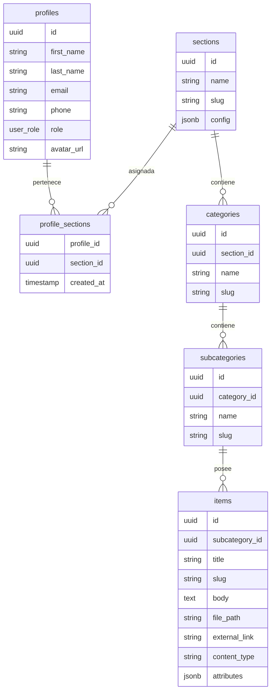

# Diseño de la BBDD: Estructura Escalable y Genérica

Este documento detalla la arquitectura de la base de datos para la plataforma CMS Telmark.

## 1. Filosofía del Diseño

El sistema está diseñado para ser **genérico** y **escalable**, permitiendo gestionar diferentes tipos de información (Adeslas, Energía, Alarma) bajo una misma estructura de 4 niveles.

### ¿Por qué UUID?

- **Seguridad**: Los IDs no son predecibles en las URLs.
- **Escalabilidad**: Evita colisiones al sincronizar datos entre diferentes entornos.

## 2. Diagrama Entidad-Relación (ERD)

> [!NOTE]
> El diagrama visual (`database_schema.png`) está actualmente en proceso de regeneración para reflejar los últimos cambios en las tablas intermediate. Puedes consultar la estructura técnica en Mermaid abajo.

### Estructura Técnica (Mermaid)



## 3. Flexibilidad con `jsonb`

Las columnas `config` (en SECTIONS) y `attributes` (en ITEMS) permiten guardar datos dinámicos sin necesidad de modificar las tablas. Esto garantiza que el sistema pueda adaptarse a nuevos requisitos sin cambios en el código base del backend.

## 5. Script SQL (Para Supabase)

Código del proyecto en Supabase para crear la estructura:

```sql
-- Enum de roles
create type user_role as enum ('superadmin', 'admin', 'usuario');

-- 0. PERFILES DE USUARIO
create table profiles (
  id uuid references auth.users(id) on delete cascade primary key,
  first_name text not null,
  last_name text not null,
  email text unique not null,
  phone text,
  role user_role default 'usuario' not null,
  avatar_url text,
  created_at timestamp with time zone default timezone('utc'::text, now()) not null,
  updated_at timestamp with time zone default timezone('utc'::text, now()) not null
);

-- 0.5. RELACIÓN PERFILES - SECCIONES
create table profile_sections (
  profile_id uuid references profiles(id) on delete cascade not null,
  section_id uuid references sections(id) on delete cascade not null,
  created_at timestamp with time zone default timezone('utc'::text, now()) not null,
  primary key (profile_id, section_id)
);

-- 1. SECCIONES
create table sections (
  id uuid default gen_random_uuid() primary key,
  name text not null,
  slug text unique not null,
  config jsonb default '{}'::jsonb,
  created_at timestamp with time zone default timezone('utc'::text, now()) not null
);

-- 2. CATEGORIAS
create table categories (
  id uuid default gen_random_uuid() primary key,
  section_id uuid references sections(id) on delete cascade not null,
  name text not null,
  slug text not null,
  created_at timestamp with time zone default timezone('utc'::text, now()) not null,
  unique(section_id, slug)
);

-- 3. SUBCATEGORIAS
create table subcategories (
  id uuid default gen_random_uuid() primary key,
  category_id uuid references categories(id) on delete cascade not null,
  name text not null,
  slug text not null,
  created_at timestamp with time zone default timezone('utc'::text, now()) not null,
  unique(category_id, slug)
);

-- 4. ITEMS (Contenido)
create table items (
  id uuid default gen_random_uuid() primary key,
  subcategory_id uuid references subcategories(id) on delete cascade not null,
  title text not null,
  slug text not null,
  body text,
  file_path text,
  external_link text,
  content_type text check (content_type in ('info', 'document', 'file', 'link')) default 'info',
  attributes jsonb default '{}'::jsonb,
  created_at timestamp with time zone default timezone('utc'::text, now()) not null,
  unique(subcategory_id, slug)
);

-- Habilitar RLS
alter table sections enable row level security;
alter table categories enable row level security;
alter table subcategories enable row level security;
alter table items enable row level security;

-- RLS para profiles
alter table profiles enable row level security;
-- Cada usuario puede ver su propio perfil
create policy "Users can view own profile" 
  on profiles for select 
  using (auth.uid() = id);
-- Cada usuario puede editar su propio perfil
create policy "Users can update own profile" 
  on profiles for update 
  using (auth.uid() = id);
-- Superadmin tiene acceso total a todos los perfiles
create policy "Superadmin full access" 
  on profiles for all 
  using (
    exists (select 1 from profiles where id = auth.uid() and role = 'superadmin')
  );

-- RLS para profile_sections
alter table profile_sections enable row level security;

-- Superadmin full access
create policy "Superadmin full access" on profile_sections for all using (
  exists (select 1 from profiles where id = auth.uid() and role = 'superadmin')
);

-- Usuarios pueden ver sus propias asignaciones
create policy "Users can view own assignments" on profile_sections for select using (
  auth.uid() = profile_id
);

-- Políticas de lectura
-- Superadmins y Admins pueden leer todas las secciones
-- Usuarios normales solo pueden leer las secciones que tengan asignadas en profile_sections
create policy "Sections access" on sections for select using (
  exists (
    select 1 from profiles 
    where id = auth.uid() 
    and (role in ('superadmin', 'admin') or 
         exists (select 1 from profile_sections where profile_id = auth.uid() and section_id = sections.id))
  )
);

create policy "Categories access" on categories for select using (
  exists (select 1 from sections where id = categories.section_id)
);

create policy "Subcategories access" on subcategories for select using (
  exists (select 1 from categories where id = subcategories.category_id)
);

  exists (select 1 from subcategories where id = items.subcategory_id)
);

-- 5. AUTOMATIZACIÓN (Triggers)
-- Crea un perfil automáticamente cuando un usuario se registra en Supabase Auth
create or replace function public.handle_new_user()
returns trigger as $$
begin
  insert into public.profiles (id, first_name, last_name, email, role)
  values (
    new.id, 
    coalesce(new.raw_user_meta_data->>'first_name', ''), 
    coalesce(new.raw_user_meta_data->>'last_name', ''), 
    new.email, 
    'usuario'
  );
  return new;
end;
$$ language plpgsql security definer;

create trigger on_auth_user_created
  after insert on auth.users
  for each row execute procedure public.handle_new_user();
```

---

## 🗺️ Navegación: Arquitectura
- 🔙 **[Volver al Hub](../INDEX.md)**
- 🔐 **[Seguridad y RLS](security-rls.md)**
- ⚙️ **[Middleware](middleware.md)**

*Última actualización: 2026-03-24*
