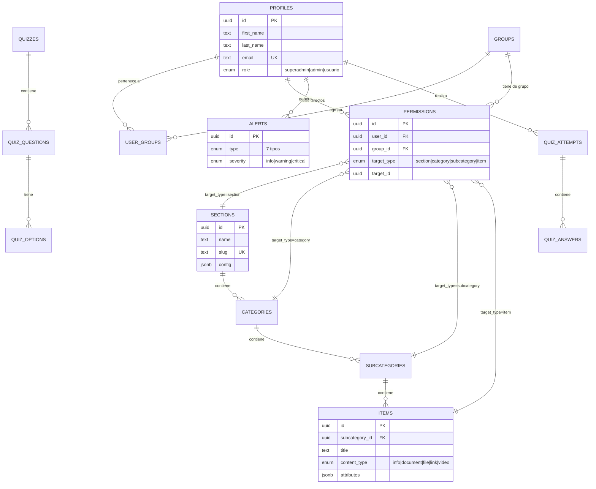

# Diseño de la BBDD: Estructura Escalable y Genérica

Este documento detalla la arquitectura de la base de datos para la plataforma CMS Telmark.

## 1. Filosofía del Diseño

El sistema está diseñado para ser **genérico** y **escalable**, permitiendo gestionar diferentes tipos de información (Adeslas, Energía, Alarma) bajo una misma estructura de jerarquía y un avanzado sistema de permisos.

### ¿Por qué UUID?

- **Seguridad**: Los IDs no son predecibles en las URLs.
- **Escalabilidad**: Evita colisiones al sincronizar datos entre diferentes entornos.

## 2. Diagrama Entidad-Relación (ERD)

### Estructura Técnica (Mermaid)

## 3. Flexibilidad con `jsonb`

Las columnas `config` (en SECTIONS) y `attributes` (en ITEMS) permiten guardar datos dinámicos sin necesidad de modificar las tablas. Esto garantiza que el sistema pueda adaptarse a nuevos requisitos sin cambios en el código base del backend.

## 4. Notas sobre Drizzle ORM

Actualmente, el proyecto utiliza **Drizzle ORM** como motor principal de acceso a datos para Server Actions, mientras que la autenticación recae directamente sobre el cliente de Supabase (GoTrue). La base de datos y sus migraciones se manejan vía Drizzle.

---

## 🗺️ Navegación: Arquitectura
- 🔙 **[Volver al Hub](../INDEX.md)**
- 🔐 **[Seguridad y RLS](security-rls.md)**
- ⚙️ **[Middleware](middleware.md)**

*Última actualización: 28 de Mayo de 2026*
